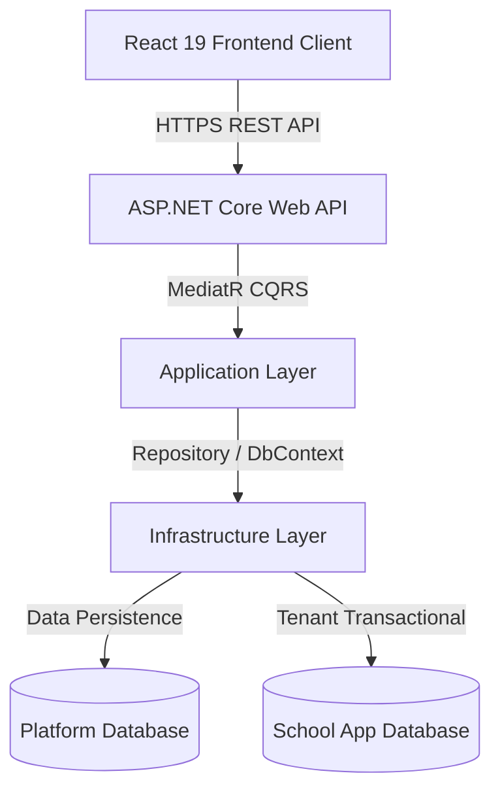
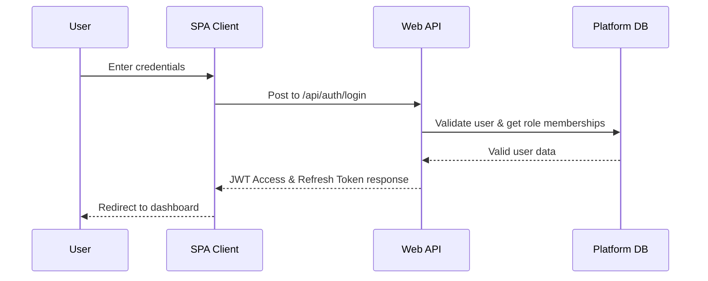
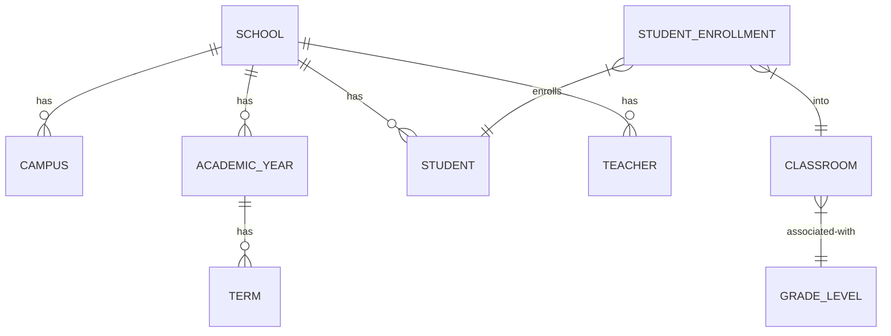
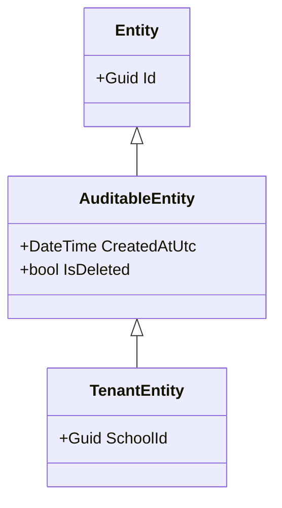
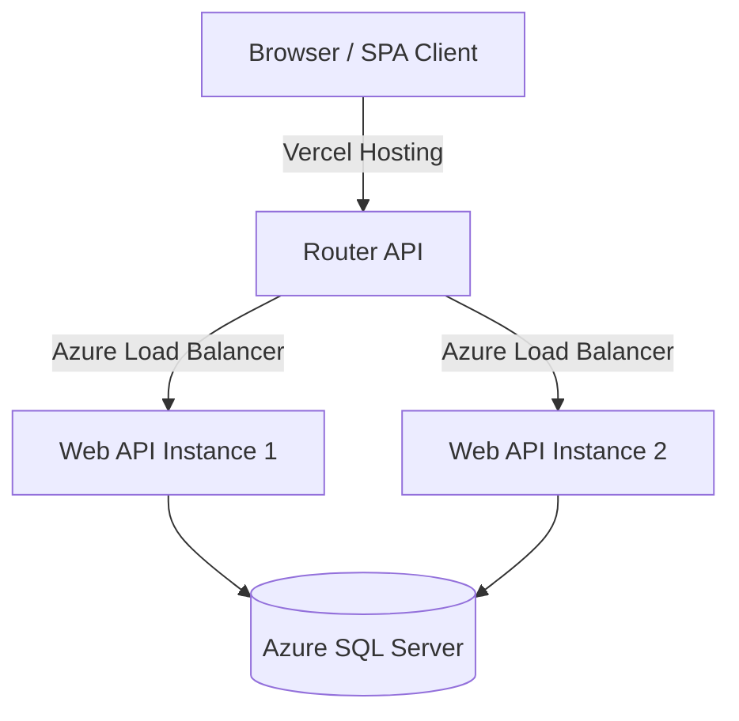

# School Management SaaS — Enterprise Solution Documentation

Welcome to the comprehensive, enterprise-grade solution documentation for the Multi-Tenant School Management SaaS application. This document serves as the single source of truth for the system's architecture, database design, frontend implementation, coding standards, deployment plans, and functional specifications.

---

## Table of Contents
1. [README.md](#1-readmemd)
2. [Executive Summary](#2-executive-summary)
3. [Business Overview](#3-business-overview)
4. [Functional Requirements](#4-functional-requirements)
5. [Non-functional Requirements](#5-non-functional-requirements)
6. [System Architecture](#6-system-architecture)
7. [Solution Architecture](#7-solution-architecture)
8. [Backend Architecture](#8-backend-architecture)
9. [Frontend Architecture](#9-frontend-architecture)
10. [Database Documentation](#10-database-documentation)
11. [Entity Documentation](#11-entity-documentation)
12. [API Documentation](#12-api-documentation)
13. [Authentication Documentation](#13-authentication-documentation)
14. [Authorization Documentation](#14-authorization-documentation)
15. [Tenant Architecture](#15-tenant-architecture)
16. [Security Documentation](#16-security-documentation)
17. [Coding Standards](#17-coding-standards)
18. [Folder Structure](#18-folder-structure)
19. [Development Guide](#19-development-guide)
20. [Installation Guide](#20-installation-guide)
21. [Environment Variables](#21-environment-variables)
22. [Configuration Guide](#22-configuration-guide)
23. [Deployment Guide](#23-deployment-guide)
24. [Docker Guide](#24-docker-guide)
25. [Azure Deployment](#25-azure-deployment)
26. [Vercel Deployment](#26-vercel-deployment)
27. [CI/CD Documentation](#27-cicd-documentation)
28. [Logging & Monitoring](#28-logging--monitoring)
29. [Error Handling](#29-error-handling)
30. [Validation Strategy](#30-validation-strategy)
31. [Performance Optimization](#31-performance-optimization)
32. [Scalability Strategy](#32-scalability-strategy)
33. [Caching Strategy](#33-caching-strategy)
34. [Background Jobs](#34-background-jobs)
35. [Email Service](#35-email-service)
36. [Payment Integration](#36-payment-integration)
37. [File Storage](#37-file-storage)
38. [Testing Documentation](#38-testing-documentation)
39. [API Reference](#39-api-reference)
40. [User Roles & Permissions](#40-user-roles--permissions)
41. [Business Rules](#41-business-rules)
42. [Sequence Diagrams](#42-sequence-diagrams)
43. [ER Diagram](#43-er-diagram)
44. [Component Diagram](#44-component-diagram)
45. [Class Diagram](#45-class-diagram)
46. [Deployment Diagram](#46-deployment-diagram)
47. [Future Improvements](#47-future-improvements)
48. [Technical Debt](#48-technical-debt)
49. [Known Limitations](#49-known-limitations)
50. [Roadmap](#50-roadmap)

---

## 1. README.md

### Multi-Tenant School Management SaaS Platform
This repository contains the backend and frontend codebases for a secure, highly scalable, multi-tenant School Management System designed on Clean Architecture principles.

*   **Backend Stack**: ASP.NET Core 10, Entity Framework Core 10, SQL Server (Platform Db + Application Db), MediatR (CQRS), FluentValidation, JWT-based Authentication.
*   **Frontend Stack**: React 19, TypeScript, Vite 6, Tailwind CSS v4, Ant Design 5, Radix UI Primitives, Zustand, TanStack Query v5, Sonner.

#### Getting Started Quick Link
For step-by-step setup, see the [Installation Guide](#20-installation-guide).

---

## 2. Executive Summary
The School Management System is designed to solve the challenges of managing multi-campus school districts and single independent schools alike. Architected as a multi-tenant SaaS application, the system uses tenant isolation patterns to ensure complete data security, compliance, and optimized performance. The target audience includes educational platforms, private education networks, and public institutions demanding clean data isolation and role-specific user portals.

---

## 3. Business Overview
The platform addresses the operational requirements of educational institutions.
*   **SaaS Tenancy Model**: Multi-tenant database architecture. The system employs a dual-database approach (PlatformDb for tenant management and master identities; AppDb for tenant-specific transactional data) to optimize database operations.
*   **Target Persona**: Platform Administrators, School/Campus Administrators, Teachers, Students, and Parents.
*   **Value Proposition**: Role-aware dashboards, centralized academic management, granular permission filters, and multi-campus configurations within a single tenancy context.

---

## 4. Functional Requirements

### User Management & Portals
*   **Platform Admin**: Configure new tenants/schools, register new School Administrators, view global analytics.
*   **School Admin**: Manage academics (academic years, terms, classrooms, grade levels, rooms), manage people (students, teachers, parents, linking parents to students), enroll students, assign teachers.
*   **Teacher**: View class schedules, manage assigned student lists, record/track class rosters.
*   **Student/Parent**: View personal profiles, academic history, schedules, and link profiles.

### Academic Configuration
*   Configure academic years (with Start/End dates) and terms (sequence, start, end).
*   Create grade levels, physical classrooms, and individual teaching rooms.

---

## 5. Non-functional Requirements
*   **Data Isolation**: Tenant entities must never bleed across subdomains or school instances.
*   **Performance**: Query times under 200ms for routine analytical and search loads via selective indices and read services.
*   **Access Control**: Least-privilege configuration enforcing permission checks on both REST APIs and Client Routes.
*   **Auditability**: Complete tracking of creation, modification, and deletion events for auditable entities.

---

## 6. System Architecture

The high-level architecture utilizes a decoupled Client-Server architecture pattern:



---

## 7. Solution Architecture
We adhere to **Clean Architecture** and **CQRS (Command Query Responsibility Segregation)**:
*   **Domain**: Defines baseline aggregates, core entities, enums, exceptions, and event patterns.
*   **Application**: Enforces use-cases, validators, handlers, CQRS command-query definitions, and interfaces.
*   **Infrastructure**: Implements EF DbContexts, data migration, security interfaces, read services, and transaction behaviors.
*   **Api**: Serves as the presentation layer exposing REST APIs and configuring host middleware.

---

## 8. Backend Architecture

### Design Patterns
*   **CQRS with MediatR**: Segregates mutation operations (Commands) from read operations (Queries) using MediatR dispatchers.
*   **Unit of Work & Repository**: Encapsulates data persistence and database commits inside structured boundaries.
*   **Pipeline Behaviors**: Enforces cross-cutting concerns like validation (`ValidationBehavior`), database transactions (`PlatformTransactionBehavior`/`AppTransactionBehavior`), and tenant checks (`TenantAuthorizationBehavior`).

---

## 9. Frontend Architecture
The React application follows the **Atomic Design** paradigm and **Feature-driven** state:
*   **Atoms**: Simple elements (e.g., `Button`, `Badge`, `Avatar`, `Typography`).
*   **Molecules**: Compound elements (e.g., `FormField`, `SearchInput`, `StatCard`, `UserMenu`).
*   **Organisms**: Self-contained components (e.g., `Sidebar`, `TopBar`, `RecentStudentsTable`).
*   **Templates**: General layout systems (e.g., `AppLayout`, `AuthLayout`).
*   **Pages**: Route views that bind store state, APIs, and templates.

---

## 10. Database Documentation
The solution uses two distinct database contexts to enforce physical isolation limits:

### 1. PlatformDbContext
*   **Purpose**: Manages overall subscription records, schools, campuses, and core login credentials/roles.
*   **Entities**: `School`, `Campus`, `UserSchoolMembership`, `RefreshToken`.

### 2. ApplicationDbContext
*   **Purpose**: Handles student records, teachers, parents, grade levels, classrooms, and enrollment activities.
*   **Entities**: `Student`, `Teacher`, `Parent`, `StudentGuardian`, `SchoolAdminProfile`, `AcademicYear`, `Term`, `GradeLevel`, `ClassRoom`, `Room`, `EducationStage`, `StudentEnrollment`, `TeachingAssignment`, `ClassSchedule`.

---

## 11. Entity Documentation

### Base Entities

#### Entity.cs
*   `Id` (Guid, Primary Key)

#### AuditableEntity.cs
Inherits from `Entity`:
*   `CreatedAtUtc` (DateTime)
*   `CreatedBy` (Guid?)
*   `ModifiedAtUtc` (DateTime?)
*   `ModifiedBy` (Guid?)
*   `IsDeleted` (bool) - Soft delete flag.
*   `DeletedAtUtc` (DateTime?)
*   `DeletedBy` (Guid?)
*   `RowVersion` (byte[]) - Optimistic concurrency control.

#### TenantEntity.cs
Inherits from `AuditableEntity`:
*   `SchoolId` (Guid, Foreign Key) - Used to separate data per school tenant.

---

## 12. API Documentation
All endpoints follow a standardized route format `/api/[controller]` and utilize the `Result<T>` wrapper for standardized payload responses.

### Schema: Result<T>
```json
{
  "isSuccess": true,
  "value": { ... },
  "error": null
}
```

---

## 13. Authentication Documentation
*   **Mechanism**: JWT Bearer Tokens.
*   **Lifetime**: Access Token (15 minutes), Refresh Token (30 days).
*   **Flow**:
    1. Post credentials to `/api/auth/login`.
    2. API returns `AccessToken`, `RefreshToken`, user metadata, and roles.
    3. The Axios client automatically attaches the `AccessToken` to the `Authorization` header of outgoing requests.
    4. Upon receiving a `401 Unauthorized` response, the Axios interceptor sends the `RefreshToken` to `/api/auth/refresh` to fetch a new token pair.

---

## 14. Authorization Documentation
The system implements granular permission checks using ASP.NET Core Policies combined with custom Claims:
*   Policies are defined for specific operational areas (e.g., `School.Read`, `Student.Create`).
*   The `TenantAuthorizationBehavior` validates that the user possesses membership in the school tenant they are requesting.

---

## 15. Tenant Architecture
Tenant separation operates on two levels:

1.  **Logical Filtering**: Global Query Filters are applied to all EF Core entities derived from `TenantEntity`:
    ```csharp
    builder.Entity<Student>().HasQueryFilter(e =>
        !e.IsDeleted && (_tenantContext.IsPlatformAdmin || e.SchoolId == _tenantContext.SchoolId));
    ```
2.  **Request Scoping**: A custom `TenantContext` parses the incoming HTTP header `X-School-Id` or JWT claims to set the context's current `SchoolId` dynamically on each request.

---

## 16. Security Documentation
*   **Passwords**: Managed securely using ASP.NET Core Identity (`UserManager`), hashing with PBKDF2.
*   **Concurrency**: EF Core optimistic concurrency tokens (`RowVersion`) block overlapping updates.
*   **Input Sanitization**: FluentValidation constraints prevent malformed payloads, and parameters are fully parameterized to prevent SQL Injection.

---

## 17. Coding Standards
*   **Backend**: 
    *   Strict Clean Architecture principles.
    *   All Domain logic encapsulated inside Domain models.
    *   No raw repository calls inside Controllers — mediated via MediatR Commands/Queries.
*   **Frontend**:
    *   Strict TypeScript types.
    *   Follow functional patterns with hooks.
    *   Component styling governed exclusively by the CSS utility variables from Tailwind v4.

---

## 18. Folder Structure

```
SchoolManagement/
├── Api/                      # Web API Presentation Layer
├── Application/              # MediatR handlers, CQRS commands & queries
├── Domain/                   # Aggregates, domain entities, value objects
├── Infrastructure/           # Database contexts, Identity, token generation
├── docs/                     # Project plans and specifications
└── frontend/                 # React 19 Frontend SPA
```

---

## 19. Development Guide

### Running unit and integration tests:
```powershell
dotnet test
```

### Formatting files:
Use prettier for the frontend:
```bash
npm run format
```

---

## 20. Installation Guide

### Prerequisites
*   .NET SDK 10
*   Node.js 18+ and npm
*   SQL Server LocalDB / SQL Server Express

### Backend Setup
1. Open a PowerShell console inside `d:\Projects\SchoolManagement`.
2. Ensure you have the `appsettings.Development.json` file inside the `Api/` folder configured.
3. Build the solution:
   ```powershell
   dotnet build
   ```
4. Run the API project:
   ```powershell
   dotnet run --project Api
   ```

### Frontend Setup
1. Open a PowerShell console inside `d:\Projects\SchoolManagement\frontend`.
2. Install client dependencies:
   ```bash
   npm install
   ```
3. Start the Vite server:
   ```bash
   npm run dev
   ```

---

## 21. Environment Variables

### Backend (`appsettings.Development.json`):
*   `ConnectionStrings:PlatformDb`: Connection details for Platform DB.
*   `ConnectionStrings:AppDb`: Connection details for Application DB.
*   `Jwt:Secret`: HMAC256 token signing key (minimum 32 characters).
*   `Seed:PlatformAdmin:Email`: Master platform administrator email.
*   `Seed:PlatformAdmin:Password`: Master platform administrator password.

---

## 22. Configuration Guide
*   **Vite Proxy**: Proxy configurations are set in `vite.config.ts` to redirect `/api` calls directly to `http://localhost:5124` during development.
*   **CORS Configuration**: Allowed origins are managed inside the `Cors:AllowedOrigins` block of `appsettings.json` and applied inside `Api/Program.cs`.

---

## 23. Deployment Guide
*   *Not implemented in codebase.* Recommended pipeline uses containerized Docker deployments.

---

## 24. Docker Guide
*   *Not implemented in codebase.* Dockerfiles and docker-compose configurations are planned for a later stage.

---

## 25. Azure Deployment
*   *Not implemented in codebase.* Recommendation is to deploy the Web API on Azure App Services and database contexts on Azure SQL databases.

---

## 26. Vercel Deployment
*   *Not implemented in codebase.* Vite SPA frontend should be linked directly to Vercel via Github hooks.

---

## 27. CI/CD Documentation
*   *Not implemented in codebase.* Recommendation is to establish GitHub Actions workflows for continuous compilation, testing, and deployment to target servers.

---

## 28. Logging & Monitoring
*   **Implementation**: Application uses built-in Microsoft logging.
*   **Logging Target**: Development console output.
*   **Recommendation**: Integrate Serilog with Seq or Elasticsearch targets.

---

## 29. Error Handling
Global exceptions are handled by custom middleware (`ExceptionHandlingMiddleware`):
*   `DomainException` results in a `400 Bad Request`.
*   Validation errors from FluentValidation result in a `400 Bad Request` with detailed error structures.
*   All other exceptions translate to a general `500 Internal Server Error`.

---

## 30. Validation Strategy
*   **Backend**: FluentValidation rules run inside the MediatR request pipeline. If any constraint fails, it throws a `ValidationException` which is parsed by `ExceptionHandlingMiddleware`.
*   **Frontend**: React Hook Form combined with Zod schemas validate form fields instantly before transmission.

---

## 31. Performance Optimization
*   **AsNoTracking**: EF Core read operations use `.AsNoTracking()` to reduce EF tracking overhead.
*   **Read Services**: Direct optimized DTO mappings in read services eliminate overhead from tracking complex model mappings.

---

## 32. Scalability Strategy
*   **Recommendations**:
    *   Deploy Web API servers as stateless instances behind an ALB.
    *   Introduce database read-replicas for read queries.
    *   Horizontal scaling of databases using tenant sharding.

---

## 33. Caching Strategy
*   *Not implemented in codebase.* Recommendations include Redis Cache for token lookups and common configurations.

---

## 34. Background Jobs
*   *Not implemented in codebase.* Recommendation is to use Hangfire or Quartz.NET.

---

## 35. Email Service
*   *Not implemented in codebase.* Recommendation is to integrate SendGrid or Amazon SES.

---

## 36. Payment Integration
*   *Not implemented in codebase.*

---

## 37. File Storage
*   *Not implemented in codebase.*

---

## 38. Testing Documentation
*   **UnitTests Project**: Checks behaviors and entity invariants.
*   **IntegrationTests Project**: Runs API controller pipelines using `WebApplicationFactory`.

---

## 39. API Reference
*   **OpenAPI v1 JSON**: Accessible at `http://localhost:5124/openapi/v1.json` on development mode.
*   **Scalar API Reference UI**: Accessible at `http://localhost:5124/scalar/v1` on development mode.

---

## 40. User Roles & Permissions
*   **SuperAdmin**: Configures global schools and platform tenants.
*   **SchoolAdmin**: Administer academic years, rooms, teachers, parents, and student cohorts.
*   **Teacher**: Read-only views of classes, view details of class schedules.

---

## 41. Business Rules
*   Academic Year end dates must follow their respective start dates.
*   New Term dates must fit inside their parent Academic Year's duration bounds.
*   Students must match only a single primary campus/school enrollment slot at any given point in time.

---

## 42. Sequence Diagrams

### Auth Flow


---

## 43. ER Diagram



---

## 44. Component Diagram

```mermaid
component
    [React SPA] --> [API Gateway / Middleware]
    [API Gateway / Middleware] --> [Academics Controller]
    [API Gateway / Middleware] --> [Auth Controller]
    [Academics Controller] --> [MediatR Handlers]
    [Auth Controller] --> [Identity Service]
```

---

## 45. Class Diagram



---

## 46. Deployment Diagram



---

## 47. Future Improvements
*   Implement Attendance, Assessment, grading structures, and fee collections.
*   Build custom schedule conflict check mechanisms.

---

## 48. Technical Debt
*   Fix the typo name on folder `/Features/Acadmics`.
*   Replace standard read models with Redis keys.

---

## 49. Known Limitations
*   Lack of multi-tenant database routing; all schools currently persist to the single SQL Db instance.

---

## 50. Roadmap
*   **Phase 1**: Add student attendance modules.
*   **Phase 2**: Introduce fee generation and collection commands.
*   **Phase 3**: Dynamic conflict schedules logic.
