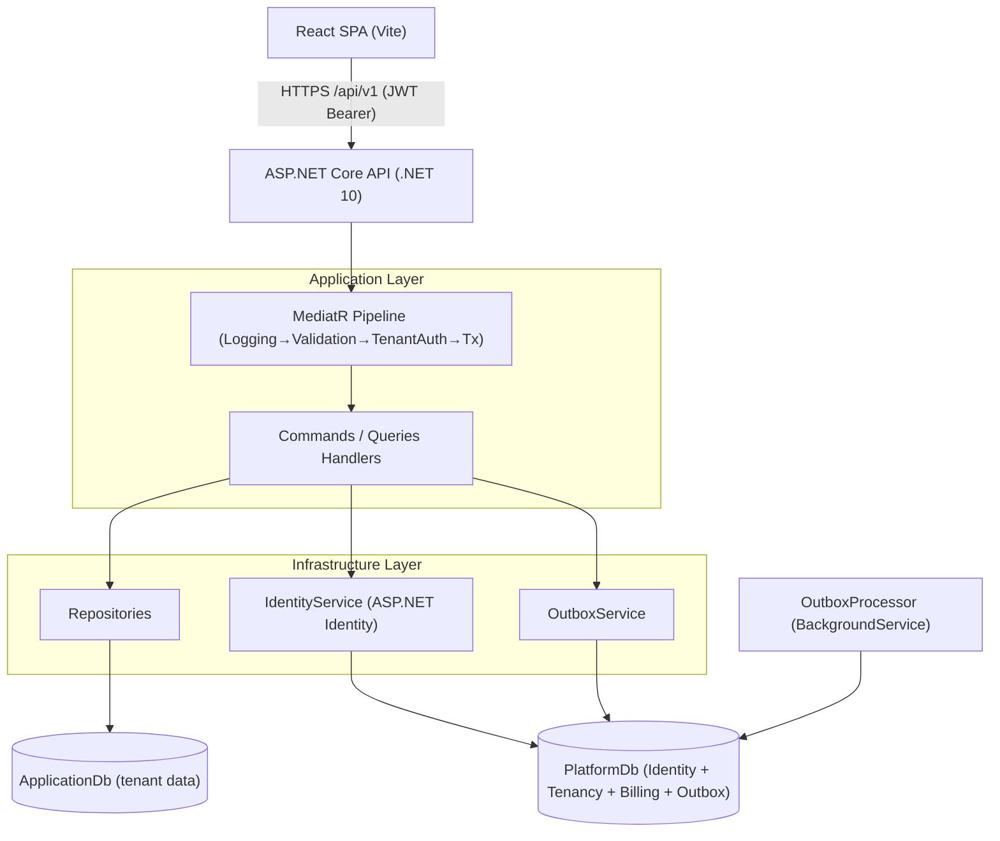
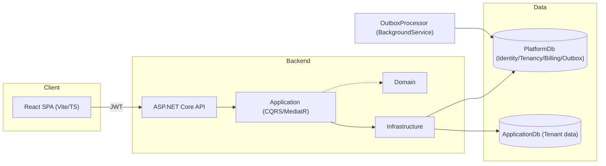
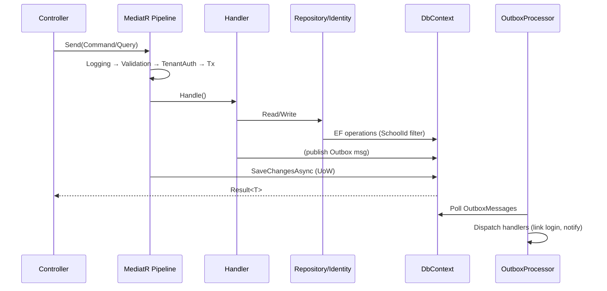
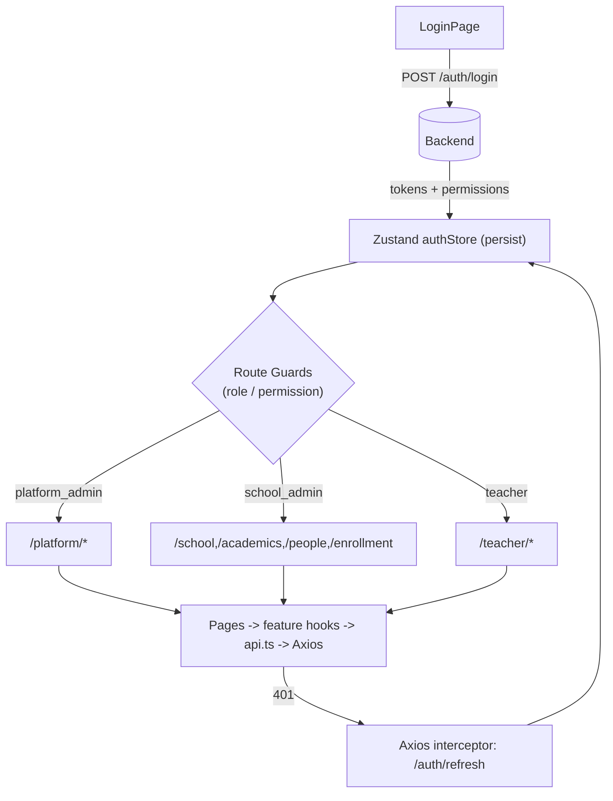
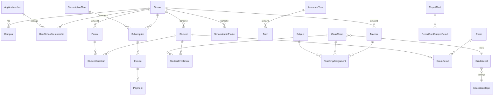

# School Management SaaS Platform — System Understanding Report

> **Status:** Read-only analysis. No code was modified.
> **Analyst lens:** Senior architect / CTO reviewing a new enterprise multi-tenant SaaS codebase.
> **Date of review:** 2026-07-20

This report separates **Confirmed** (observed directly in code) from **Assumed** (inferred from structure/patterns) information.

---

## 1. Business Understanding

### 1.1 What problem does this system solve?
**Confirmed.** This is a **multi-tenant School Management ERP (SaaS)**. A single deployed platform serves many independent schools ("tenants"). Each school gets its own isolated academic, people, attendance, exam, billing, and notification data. A central **Platform Admin** (Super Admin) operates the platform as a business: onboarding schools, registering school administrators, viewing cross-tenant analytics, and managing subscription/billing plans.

The domain is a classic school ERP: schools are organized by academic years → terms → grade levels → classrooms; people are students, teachers, parents (guardians); operational modules cover enrollment, scheduling, attendance, assignments, exams/grades, report cards, billing/subscriptions, and notifications.

### 1.2 Who are the users?
**Confirmed** (from `PermissionProvider.cs`, `DataSeeder.cs`, role seed list `SuperAdmin, SchoolAdmin, Teacher, Student, Parent`):

| Role | Persona | Scope |
|---|---|---|
| **SuperAdmin / Platform Admin** | SaaS operator | All schools (cross-tenant) |
| **SchoolAdmin** | Principal / school back-office | One school |
| **Teacher** | Educator | Their classes in one school |
| **Student** | Learner | Their own data |
| **Parent** | Guardian | Their children's data |

### 1.3 Business workflows
**Confirmed** from endpoints, commands, and seed data:
1. **Onboarding:** Platform Admin creates a School → registers a School Admin (outbox-driven profile creation) → School Admin populates academics, people, enrollment.
2. **Academic setup:** Education stages → grade levels → academic years + terms → classrooms + rooms → subjects.
3. **People management:** Create students/teachers/parents (optionally creating login accounts).
4. **Enrollment:** Enroll students into classrooms; assign teachers (with schedule slots + rooms).
5. **Daily operations:** Record attendance; create assignments; submit/grade assignments; create exams; record exam results; generate report cards.
6. **Billing:** Subscription plans → school subscriptions → invoices → payments.
7. **Notifications:** Device tokens → notification batches delivered via outbox.
8. **Self-service:** Students view schedule/grades/assignments; Parents monitor children.

### 1.4 Business summary
A white-label school operating system. The platform sells seats/subscriptions to schools and provides each school a full back-office plus teacher/student/parent portals, all from one codebase with strict per-school data isolation.

---

## 2. Architecture Understanding

### 2.1 Overall architecture
**Confirmed.** Two deployable tiers:
- **Backend:** ASP.NET Core 10 Web API (`.NET 10.0`), Minimal-Controllers style (thin controllers, no MVC views).
- **Frontend:** React 18 + Vite 6 + TypeScript SPA.
- **Persistence:** SQL Server (EF Core 10) with **two databases**.
- **Cross-cutting:** JWT auth, MediatR CQRS pipeline, Outbox background processor.



### 2.2 Backend architecture — patterns used
**Confirmed** from project references and `DependencyInjection.cs`:
- **Clean Architecture / Layered Architecture** — strict dependency direction: `Api → Application → Domain`; `Infrastructure → Application` (inversion via DI). `Api.csproj` references only `Application` and `Infrastructure`. `Application.csproj` references only `Domain`.
- **CQRS** — Commands vs Queries separated in `Application/Features/.../Commands` and `.../Queries`.
- **MediatR** (v14) — every request is `IRequest`/`IRequestHandler`; pipeline behaviors provide cross-cutting concerns.
- **Repository Pattern** — `I*Repository` interfaces in Application, EF implementations in Infrastructure.
- **Unit of Work** — `IUnitOfWork` / `IPlatformUnitOfWork` wrapping `SaveChangesAsync`.
- **FluentValidation** — validators per command, wired into the pipeline.
- **Outbox Pattern** — persisted `OutboxMessage` + `OutboxProcessor` background service for reliable side-effects (linking logins, delivering notifications).
- **Domain-Driven Design-lite** — rich entities with factory `Create()` methods, `AuditableEntity`/`TenantEntity` base classes, `IAggregateRoot`, domain events base types.
- **Global Query Filters** — tenant isolation and soft-delete enforced at EF Core model level.

**Why suitable:** CQRS + MediatR cleanly segregates the many school-ERP use cases; the pipeline centralizes authz, validation, and transactions (critical for a multi-tenant system where tenant checks must never be forgotten); the Outbox gives reliable eventual consistency for cross-context actions without coupling handlers to delivery.

### 2.3 Frontend architecture — patterns used
**Confirmed** from `package.json`, `src/` tree, `router/`:
- **Feature-based folder structure** — `src/features/*` (academics, auth, dashboard, students, teachers, parents, enrollment, educationStages, importExport) each owning its `api.ts` + `hooks.ts`.
- **Atomic Design** — `components/atoms → molecules → organisms → templates`.
- **Role-based routing** — `router/routes.tsx` with `ProtectedRoute` (role guard) and `RequirePermission` (permission guard).
- **Server-state via TanStack Query** (`@tanstack/react-query`); **client-state via Zustand** (`authStore`, `themeStore`, `uiStore`).
- **Forms via React Hook Form + Zod**; UI via **Ant Design 5** + **Tailwind 4** + Radix primitives.
- **API client** — single Axios instance (`lib/axios.ts`) with request (attach JWT) and response (401 → refresh → retry) interceptors.

### 2.4 Communication between components
- **Frontend → Backend:** REST/JSON over HTTPS, `baseURL: "/api/v1"`, JWT Bearer. Automatic token refresh on 401.
- **Backend internal:** Controllers → MediatR → Handlers → Repositories/Identity/Outbox → EF DbContexts → SQL Server.
- **Async side-effects:** Handlers publish Outbox messages; `OutboxProcessor` (hosted service) polls and dispatches.

---

## 3. Backend Deep Analysis

### 3.1 Technology
**Confirmed** (from `.csproj` files and `Program.cs`):
- **Framework:** ASP.NET Core 10 (`net10.0`), nullable enabled.
- **CQRS/Mediator:** MediatR 14.1.0.
- **Validation:** FluentValidation 12.1.1.
- **ORM:** Entity Framework Core 10 (`Microsoft.EntityFrameworkCore` / `.Design` 10.0.9) with SQL Server provider.
- **Identity:** ASP.NET Core Identity (`IdentityUser`/`IdentityRole<Guid>`), `ApplicationUser` extends `IdentityUser`.
- **Auth:** JWT Bearer (`System.IdentityModel.Tokens.Jwt` via `JwtBearerDefaults`), configured in `Program.cs`.
- **API docs:** Scalar (`Scalar.AspNetCore` 2.16.15) + OpenAPI 10.
- **DBs:** Two SQL Server databases (connection strings `ApplicationDb`, `PlatformDb`).

### 3.2 Layers

#### API Layer (`Api/`)
**Confirmed. Responsibility:** HTTP boundary — routing, auth attribute decoration, mapping requests to MediatR, translating `Result<T>` to HTTP responses.
- `Controllers/` (thin): `AuthController`, `SchoolsController`, `AcademicsController`, `PeopleController`, `EnrollmentController`, `AssignmentsController`, `AttendanceController`, `ExamsController`, `BillingController`, `NotificationsController`, `EducationStagesController`, `SubjectsController`, `PortalController`.
- `ApiControllerBase` — base for all controllers; `FromResult`/`Created` helpers mapping `Result` → `200/400/201`.
- `Middleware/ExceptionHandlingMiddleware` — global error → consistent error shape.
- `Program.cs` — composition root: CORS, JWT, **authorization policies per permission**, OpenAPI, seeding, middleware ordering.

**Communication:** Controllers depend only on `IMediator` (and the request record types). They never touch repositories directly.

#### Application Layer (`Application/`)
**Confirmed. Responsibility:** Use-case orchestration, business rules for operations, validation, DTO projection. Depends only on `Domain`.
- `Common/Behaviors/` — MediatR pipeline: `LoggingBehavior`, `ValidationBehavior`, `TenantAuthorizationBehavior`, `AppTransactionBehavior`, `PlatformTransactionBehavior`.
- `Common/Interfaces/` — repository + service contracts (`IUnitOfWork`, `ITenantContext`, `ICurrentUserService`, `IIdentityService`, `IJwtTokenService`, `IPermissionProvider`, `IOutboxService`, `I*Repository`, `I*ReadService`).
- `Common/Models/` — `Result`, `PagedResult`, `JwtSettings`, `AuthenticatedUser`, `TokenResult`.
- `Common/Services/` — `PermissionProvider` (role→permission matrix).
- `Common/Messages/` — outbox message contracts.
- `Features/<Module>/Commands|Queries/...` — one folder per use case containing Command/Query + Handler (+ optional Validator, DTOs).

**Communication:** Handlers receive repositories/services via constructor injection; return `Result<T>`; read services project EF entities to DTOs (bypassing tenant filter where needed for cross-tenant reads).

#### Domain Layer (`Domain/`)
**Confirmed. Responsibility:** Core business model, invariants, no external dependencies. Pure class library (`Domain.csproj` references nothing).
- `Common/` — `Entity`, `AuditableEntity` (CreatedBy/At, UpdatedBy/At, `IsDeleted`), `TenantEntity` (adds `SchoolId`), `ValueObject`, `IAggregateRoot`, `IDomainEvent`/`BaseDomainEvent`.
- `Entities/` — grouped by bounded context (Academics, People, Enrollment, Attendance, Assignments, Exams, Billing, Documents, Notifications, Outbox, Tenancy).
- `Enums/` — `EmploymentStatus`, `GuardianRelationshipType`, `DayOfWeekEnum`, `AttendanceStatus`, `EnrollmentStatus`, `SubmissionStatus`, `AcademicYearStatus`, `DocumentOwnerType`.
- `Exceptions/` — `DomainException`.

#### Infrastructure Layer (`Infrastructure/`)
**Confirmed. Responsibility:** Persistence, identity, JWT, multi-tenancy context, outbox delivery. Implements Application contracts.
- `Persistence/` — `ApplicationDbContext`, `PlatformDbContext`, `Configurations/*` (per-entity EF config), `Repositories/`, `Services/` (read services), `Interceptors/AuditSaveChangesInterceptor`, `Seed/DataSeeder`.
- `Identity/` — `ApplicationUser`, `CurrentUserService`, `TenantContext`, `IdentityService`.
- `Authentication/` — `JwtTokenService`.
- `Outbox/` — `OutboxProcessor`, `OutboxService`, `OutboxMessageHandlers`.
- `Migrations/` — `ApplicationDb/`, `Platform/`.
- `DependencyInjection.cs` — registers everything.

### 3.3 Entities (Domain)
**Confirmed** (from `Domain/Entities/`):

**Tenancy (`Tenancy/`):**
- `School` (aggregate root) — name, subdomainCode, status, campuses.
- `Campus` — school sub-location.
- `UserSchoolMembership` — links `ApplicationUser` ↔ `School` (a user can belong to multiple schools).
- `RefreshToken` — refresh token storage per user.

**People (`People/`):**
- `Student` (tenant) — studentCode, name, DOB, nationalId, linked login.
- `Teacher` (tenant) — employeeCode, name, employmentStatus, linked login.
- `Parent` (tenant) — name, linked login.
- `StudentGuardian` (tenant) — link Student↔Parent + relationshipType, isPrimaryContact, canViewGrades/Billing.
- `SchoolAdminProfile` (tenant) — marks a user as admin of a school.

**Academics (`Academics/`):**
- `EducationStage` (e.g., Primary/Middle/Secondary), `GradeLevel`, `AcademicYear` (+ status), `Term`, `ClassRoom`, `Room`, `Subject`, `CurriculumSubject`.

**Enrollment (`Enrollment/`):**
- `StudentEnrollment` (student↔classroom↔academicYear), `TeachingAssignment` (teacher↔subject↔classroom↔term), `ClassSchedule` (schedule slots).

**Attendance (`Attendance/`):** `AttendanceSession`, `AttendanceRecord`.
**Assignments (`Assignments/`):** `Assignment`, `AssignmentSubmission`, `AssignmentSubmissionDocument`.
**Exams (`Exams/`):** `Exam`, `ExamSchedule`, `ExamResult`, `ReportCard`, `ReportCardSubjectResult`.
**Billing (`Billing/`):** `SubscriptionPlan`, `Subscription`, `Invoice`, `Payment`.
**Documents (`Documents/`):** `Document`.
**Notifications (`Notifications/`):** `NotificationTemplate`, `NotificationBatch`, `Notification`, `DeviceToken`.
**Outbox (`Outbox/`):** `OutboxMessage`.

**Relationships:** School 1—* Campus; School 1—* UserSchoolMembership *—1 ApplicationUser; School 1—* (most tenant entities via `SchoolId`); Student 1—* StudentGuardian *—1 Parent; ClassRoom *—* Student via StudentEnrollment; Teacher *—* ClassRoom via TeachingAssignment; Exam 1—* ExamResult 1—* ReportCard→ReportCardSubjectResult.

### 3.4 CQRS details
**Confirmed.**
- **Commands** (write): e.g., `CreateSchoolCommand`, `CreateStudentCommand`, `EnrollStudentCommand`, `AssignTeacherCommand`, `RecordAttendanceCommand`, `CreateExamCommand`, `RecordExamResultsCommand`, `GenerateReportCardCommand`, `SendNotificationCommand`, billing commands. Return `Result<Guid>` or similar.
- **Queries** (read): e.g., `GetAllSchoolsQuery`, `GetStudentsQuery`, `GetMyClassesQuery`, `GetSchoolDashboardQuery`, `GetClassExamResultsQuery`. Return DTOs / `PagedResult<T>`.
- **Handlers:** `IRequestHandler<,>` implementations, one per use case.
- **Pipeline behaviors** (execution order, from `Application/DependencyInjection.cs`):
  1. `LoggingBehavior` — logs request name + duration, flags slow handlers.
  2. `ValidationBehavior` — runs FluentValidation validators; throws on failure.
  3. `TenantAuthorizationBehavior` — if request implements `ITenantScopedRequest`, verifies `request.SchoolId == _tenantContext.SchoolId` (unless platform admin).
  4. `AppTransactionBehavior` — calls `SaveChangesAsync` for commands touching the application DB.
  5. `PlatformTransactionBehavior` — transaction for platform DB (identity/billing/outbox).

### 3.5 Request flow (API → Application → Domain → DB)
**Confirmed** example: `POST /api/v1/People/students`
1. `PeopleController` → `mediator.Send(CreateStudentCommand)` (`ApiControllerBase.FromResult`).
2. Pipeline: Logging → Validation (`CreateStudentCommandValidator`) → TenantAuth (`ITenantScopedRequest`) → Transaction.
3. `CreateStudentCommandHandler` calls domain `Student.Create(...)`, checks duplicate via `IStudentRepository.ExistsAsync`, optionally `IIdentityService.CreateUserAsync` + `AddToRoleAsync("Student")`, publishes `LinkStudentLoginMessage` to outbox, `await _students.AddAsync`.
4. `AppTransactionBehavior` → `UnitOfWork.SaveChangesAsync()` → `ApplicationDbContext` writes Student row (with `SchoolId` from `TenantContext`).
5. Later, `OutboxProcessor` reads `OutboxMessage`, dispatches `LinkStudentLoginHandler` to associate the Identity user with the `Student` row.

---

## 4. Frontend Deep Analysis

### 4.1 Framework & stack
**Confirmed** (`package.json`): React 18.3, Vite 6, TypeScript 5.8, Tailwind 4 + Ant Design 5, TanStack Query 5, Zustand 5, React Hook Form 7 + Zod 3, React Router 7, Axios 1, lucide-react, sonner (toasts), xlsx (import/export).

### 4.2 Folder structure
**Confirmed:**
```
src/
  api.ts (axios)            lib/ (axios, constants, queryClient, excel, utils)
  components/ (atoms, molecules, organisms, templates, importExport)
  features/  (academics, auth, dashboard, students, teachers, parents,
              enrollment, educationStages, importExport)  -> each api.ts + hooks.ts
  hooks/ (usePermissions)
  layouts/ (AppLayout, AuthLayout)
  pages/ (auth, platform, school, teacher, PlaceholderPage)
  router/ (routes, guards, RequirePermission, index)
  store/ (authStore, themeStore, uiStore)
  styles/ (antd-theme, globals.css)
  types/ (auth, api, student, teacher, parent, academic, enrollment, dashboard)
```

### 4.3 Component architecture
**Confirmed.** Atomic Design. `atoms` (Button, Input, Avatar, Badge, Spinner, Typography, IconButton) → `molecules` (StatCard, SearchInput, UserMenu, NotificationBell, StatusBadge, QuickActionCard) → `organisms` (Sidebar, TopBar, DashboardHeader, *Tables, *Panels) → `templates` (DashboardTemplate) → `pages`.

### 4.4 State management
- **Server state:** TanStack Query. Each feature's `hooks.ts` wraps `api.ts` calls (e.g., `useSchoolDashboard`, `useTeacherDashboard`, `useStudents`).
- **Client/auth state:** Zustand `authStore` (persisted to `localStorage` under `"auth-storage"`). Holds user, accessToken, refreshToken, `hasPermission`, `isRole`.
- **Theme/UI:** `themeStore`, `uiStore`.

### 4.5 API communication
**Confirmed** (`lib/axios.ts`):
- Axios instance, `baseURL "/api/v1"`, 15s timeout.
- **Request interceptor:** attaches `Authorization: Bearer <accessToken>`.
- **Response interceptor:** on `401`, calls `/auth/refresh` with refresh token, updates store, retries original request; on failure clears auth and redirects to `/auth/login`.
- Feature `api.ts` files export typed endpoint functions (e.g., `StudentsApi.getStudents`, `AuthApi.login`).

### 4.6 Authentication handling
**Confirmed** (`authStore.ts`, `LoginPage.tsx`): Login posts to `/auth/login`; JWT is **decoded client-side** (`decodeJwt`) to extract `permission` claims + `is_platform_admin` + role. Permissions and role drive routing/guards. Tokens persisted via Zustand `persist`.

> **Note (assumption flagged):** Storing tokens in `localStorage` (via Zustand persist) exposes them to XSS. This is a security observation, not a code change request.

### 4.7 Routing
**Confirmed** (`router/routes.tsx`, `guards.tsx`, `RequirePermission.tsx`):
- `/auth/login` — public.
- `/platform/*` — `ProtectedRoute requiredRole="platform_admin"` (SuperAdmin).
- `/school/*` — `RequirePermission permission="school.dashboard" requiredRole="school_admin"`.
- `/academics/*`, `/people/*`, `/enrollment/*` — `RequirePermission` with role `school_admin`.
- `/teacher/*` — `ProtectedRoute requiredRole="teacher"`.
- `*` → redirect to `/auth/login`.
- Platform admin (`isPlatformAdmin`) bypasses role checks (can enter any area) but **student/parent portals are not routed** (no `/student` or `/parent` routes exist yet).

### 4.8 Role-based portals

**Platform Admin (`/platform`):** Confirmed pages — PlatformDashboard, Schools (list/detail/edit/new), RegisterAdmin, ImportDocs guide. Features: cross-school analytics, school lifecycle (create/suspend/reactivate), school-admin registration, subscription/billing oversight (backend only).

**School Admin (`/school`, `/academics`, `/people`, `/enrollment`):** Confirmed pages — SchoolDashboard (stat cards, recent students, announcements, attendance summary, charts placeholder), AcademicYears/Classrooms/GradeLevels/EducationStages/Rooms, Students/Teachers/Parents (+ detail pages), Enrollment + AssignTeacher. Workflow: set up academics → manage people → enroll → operate daily modules.

**Teacher (`/teacher`):** Confirmed — TeacherDashboard (my classes, today's lessons, pending attendance, upcoming lessons). Quick actions link to `/teacher/attendance`, `/teacher/grades`, `/teacher/classes` — **but these routes do NOT exist yet** (only `index` and `classes` placeholder are registered; `attendance`/`grades` are dead links). Assumed: attendance entry + grade entry are intended.

**Student:** **Not implemented in frontend.** No `/student` route, no student pages. Backend supports `Profile.Read`, `Grade.ReadOwn`, `Assignment.Read/Submit`, `Exam.ReadOwn`, `ReportCard.ReadOwn`, `Schedule.Read` — but the SPA has no student portal.

**Parent:** **Not implemented in frontend.** No `/parent` route. Backend supports `Children.Read`, `Grade.ReadChild`, `Attendance.ReadChild`, `Assignment.ReadChild`, `Exam.ReadChild`, `ReportCard.ReadChild`, `Schedule.ReadChild`, `Notification.Read` — but no parent portal exists.

---

## 5. Database Understanding

### 5.1 Design & multi-tenancy approach
**Confirmed.** Two SQL Server databases:
- **PlatformDb** (`PlatformDbContext : IdentityDbContext`) — Identity (users/roles), tenancy (`School`, `Campus`, `UserSchoolMembership`, `RefreshToken`), billing (`SubscriptionPlan`, `Subscription`, `Invoice`, `Payment`), outbox (`OutboxMessage`).
- **ApplicationDb** (`ApplicationDbContext : DbContext`) — all tenant-scoped operational data (people, academics, enrollment, attendance, assignments, exams, notifications, documents).

**Multi-tenancy strategy: Shared database, shared schema, discriminator column (`SchoolId`).** Every tenant entity derives from `TenantEntity` (which adds `SchoolId`). Isolation is enforced by **EF Core global query filters** (`ApplicationDbContext.ApplyTenantFilter<T>`): `e => !e.IsDeleted && (_tenantContext.IsPlatformAdmin || e.SchoolId == _tenantContext.SchoolId)`.

This means there is **no separate database per tenant** — isolation is logical via `SchoolId` + query filters, not physical.

### 5.2 Soft delete
**Confirmed.** `AuditableEntity.IsDeleted` + `ApplySoftDeleteFilter<T>` for sub-entities (Term, ClassSchedule, AttendanceRecord, AssignmentSubmission*, ExamResult, ReportCardSubjectResult, Notification). Tenant entities get soft-delete + tenant filter combined.

### 5.3 Platform Database entities (purpose: platform + identity + cross-cutting)
`AspNetUsers`/`AspNetRoles` (via `ApplicationUser`), `School`, `Campus`, `UserSchoolMembership`, `RefreshToken`, `SubscriptionPlan`, `Subscription`, `Invoice`, `Payment`, `OutboxMessage`.

### 5.4 Application Database entities (purpose: per-school operational data)
`Student`, `Teacher`, `Parent`, `StudentGuardian`, `SchoolAdminProfile`, `EducationStage`, `GradeLevel`, `AcademicYear`, `Term`, `ClassRoom`, `Room`, `Subject`, `CurriculumSubject`, `StudentEnrollment`, `TeachingAssignment`, `ClassSchedule`, `AttendanceSession`, `AttendanceRecord`, `Assignment`, `AssignmentSubmission`, `AssignmentSubmissionDocument`, `Exam`, `ExamSchedule`, `ExamResult`, `ReportCard`, `ReportCardSubjectResult`, `NotificationTemplate`, `NotificationBatch`, `Notification`, `DeviceToken`, `Document`.

> **Assumption:** Credentials/email logins are global in PlatformDb; a single `ApplicationUser` may map to multiple schools via `UserSchoolMembership`, enabling the "switch school" feature. The `SchoolId` on login selects the active tenant context.

---

## 6. API Understanding

**Confirmed** (from `docs/api-documentation.md` + controller source). Base: `http://localhost:5124/api/v1`, docs at `/scalar/v1`.

### Auth (`AuthController`)
| Endpoint | Auth | Notes |
|---|---|---|
| `POST /Auth/login` | Anonymous | Returns access+refresh token, user, permissions. Optional `schoolId`. |
| `POST /Auth/refresh` | Anonymous | Refresh token → new tokens. |
| `POST /Auth/register-school-admin` | `School.Create` | Platform admin registers a school admin. |
| `GET /Auth/memberships` | Authenticated | List user's school memberships. |
| `POST /Auth/switch-school` | Authenticated | Switch active tenant context. |

### Schools (`SchoolsController`) — Platform-level
`GET /Schools` (`School.Read`, paginated), `POST /Schools` (`School.Create`), `GET /Schools/analytics` (`Platform.Analytics`), `GET /Schools/{id}` (`School.Read`), `GET /Schools/{id}/dashboard` (`School.Dashboard`), `PUT /Schools/{id}` (`School.Update`), `POST /Schools/{id}/campuses` (`School.Update`), `POST /Schools/{id}/suspend|reactivate` (`School.Update`).

### Academics (`AcademicsController`)
AcademicYears (CRUD-ish, `AcademicYear.Read/Create/Update`), Terms (`AcademicYear.Create`), Classrooms (`ClassRoom.Read/Create/Update`), GradeLevels (`GradeLevel.Read/Update`, create uses `AcademicYear.Create`), Rooms (`Room.Read/Update`, create uses `ClassRoom.Create`), Subjects, EducationStages.

### People (`PeopleController`)
Students (list/detail/create/update + link guardian), Teachers (list/detail/create/update + terminate), Parents (list/detail/create/update), and self-service: `GET /People/me/student-profile` (`Profile.Read`), `GET /People/me/children` (`Children.Read`), `GET /People/me/classes` (`MyClasses.Read`).

### Enrollment (`EnrollmentController`)
`POST /Enrollment/students` (`Enrollment.Create`), `POST /Enrollment/teachers` (`Schedule.Create`, with `ScheduleSlot[]`).

### Assignments / Attendance / Exams / Billing / Notifications / Portal / Subjects / EducationStages
**Confirmed existence** of controllers + handlers for these modules (commands/queries present), though the public `api-documentation.md` primarily documents Auth/Schools/Academics/People/Enrollment. Permission policies registered for: `Assignment.Create/Submit/Read/ReadOwn`, `Attendance.Record/ReadOwn/ReadChild`, `Schedule.Read`, `Grade.Enter`, `Billing.Read/Manage`, `Exam.Read/Create/Manage`, `Notification.Read/Send`.

**Request/response flow:** Controller validates via attribute (`[Authorize(Policy=...)]`) → maps to command/query → MediatR pipeline → handler returns `Result<T>` → `ApiControllerBase.FromResult` → `200/201` with value or `400` `{error}` (also `401/403/404` from middleware/filters). Consistent error envelope `{status, message, errors}`.

---

## 7. Security Understanding

**Confirmed.**
- **Authentication:** ASP.NET Identity (`ApplicationUser`, `IdentityRole<Guid>`) + JWT Bearer. Password policy: min length 8, require non-alphanumeric, unique email, lockout after 5 failures for 15 min (`DependencyInjection.cs`).
- **JWT:** Issued by `JwtTokenService`. `Program.cs` enforces `ValidateIssuer`, `ValidateAudience`, `ValidateLifetime`, `ValidateIssuerSigningKey`; secret must be ≥256 bits; `ClockSkew=30s`; `MapInboundClaims=false`.
- **Refresh tokens:** Stored (`RefreshToken` entity in PlatformDb); `POST /Auth/refresh` issues new access token. Frontend auto-refreshes on 401.
- **Authorization (permissions):** Claims-based. JWT carries `permission` claims + `is_platform_admin`. `Program.cs` builds one authorization **policy per permission**; each policy succeeds if `is_platform_admin=true` OR the user has the `permission` claim. Controllers decorate endpoints with `[Authorize(Policy="X.Read")]`.
- **Tenant isolation:** Two layers — (1) JWT contextual `SchoolId`/platform-admin flag resolved into `ITenantContext` (`TenantContext`); (2) `TenantAuthorizationBehavior` rejects tenant-scoped requests whose `SchoolId` ≠ caller's school (unless platform admin); (3) EF global query filters (`ApplicationDbContext`) physically restrict reads to the caller's `SchoolId`. This is defense-in-depth.
- **Audit:** `AuditSaveChangesInterceptor` populates `CreatedBy/At`, `UpdatedBy/At` on save.
- **CORS:** `Development` (allow any) vs `Frontend` (configured origins) policy by environment.
- **Outbox:** Side-effects (login linking, notification delivery) are durable and retried (`MaxRetries`), preventing lost writes on failure.

**Assumptions / observations (not changes):**
- Tokens persisted in `localStorage` (XSS exposure risk).
- No visible rate-limiting on login/refresh beyond Identity lockout.
- `SchoolId` passed in request bodies for tenant-scoped commands is re-validated by `TenantAuthorizationBehavior` — good; but handlers must still trust `TenantContext.SchoolId` over a forged body value (the behavior checks `tenantRequest.SchoolId`, so the caller cannot escalate to another school).

---

## 8. Current System Status

### Implemented (Confirmed working capabilities)
- Full multi-tenant scaffolding: two-DB architecture, tenant global filters, `UserSchoolMembership`, school lifecycle (create/suspend/reactivate/campus).
- Identity + JWT auth + refresh tokens + switch-school + memberships.
- Platform admin portal (schools, analytics, register admin, billing plans).
- School admin portal: academics (years/terms/classrooms/grade levels/rooms/subjects/education stages), people (students/teachers/parents + detail pages + link guardian), enrollment (students + teacher assignment with schedule), school dashboard.
- Domain + infrastructure for: attendance, assignments (create/submit/grade), exams (create/schedule/results/report cards), billing (plans/subscriptions/invoices/payments), notifications (templates/batches/device tokens), documents, outbox.
- CQRS pipeline (logging, validation, tenant-auth, transactions), soft-delete, audit interceptor, seed data (demo accounts for all 5 roles, education stages, subjects, subscription plans).
- Notifications outbox delivery, login-linking outbox handlers.
- Frontend: auth flow, role/permission routing guards, school-admin + teacher dashboards, people/academics/enrollment pages, Excel import/export scaffolding (`xlsx`, `importExport`), TanStack Query + Zustand state.

### Incomplete / Gaps
- **Student portal:** Backend permissions + self-service queries exist (`/People/me/student-profile`, `GetStudentSchedule`, assignments/exams/report-card reads) but **no frontend routes/pages**.
- **Parent portal:** Same — backend supports child monitoring, **no frontend**.
- **Teacher deep workflows:** Dashboard links to `/teacher/attendance` and `/teacher/grades` are **dead links** (routes not registered; only `index` + `classes` placeholder exist).
- **Frontend module coverage gaps:** Assignments, Attendance, Exams, Billing, Notifications have backend + `api.ts`/hooks in some cases but **no dedicated pages** (only School/Teacher dashboards + academics/people/enrollment pages exist).
- **Billing/Notifications UI:** No frontend pages; backend-only.
- **EducationStages controller** exists; frontend has `EducationStagesPage`.
- **Assumed minor inconsistencies:** Some permission strings differ in casing between `PermissionProvider` (`school.read`) and `Program.cs` policies (`School.Read`) — but policy matching lowercases the claim (`permission.ToLowerInvariant()`), so they reconcile. Some `api-documentation.md` permission names (e.g., `academicyearread`) differ in format from registered policies (`AcademicYear.Read`) — likely doc vs code drift.
- **No automated tests executed during this review**; `UnitTests`/`IntegrationTests` projects exist but were not run (read-only task).

---

## 9. System Map

### A) High-level architecture


### B) Backend request flow


### C) Frontend application flow


### D) Database relationship overview


---

## 10. Final Understanding Summary — System Mental Model

**What the system is:** A .NET 10 + React multi-tenant School Management SaaS. One platform serves many schools with strict logical data isolation (`SchoolId` discriminator + EF global query filters). The backend is a Clean-Architecture CQRS API (MediatR + FluentValidation + Repository/UoW + Outbox). The frontend is a feature-sliced React SPA with role/permission-guarded routing.

**How it works:**
- Requests enter thin controllers → MediatR → a 5-stage pipeline (Logging → Validation → TenantAuth → AppTx → PlatformTx) → feature handlers → repositories/Identity/Outbox → two SQL Server DBs.
- Auth is JWT (access + refresh) issued by `JwtTokenService`; permissions are claims; policies are registered per permission in `Program.cs`. Tenant scope is enforced three ways (JWT context, pipeline behavior, EF filter).
- Side-effects (linking a new person to their login, delivering notifications) are durable via the Outbox pattern (`OutboxMessage` + `OutboxProcessor` background service).
- Frontend decodes the JWT client-side to drive guards; Axios auto-refreshes on 401; TanStack Query manages server state; Zustand holds auth/session.

**Where to add new features:**
- **New API endpoint:** add a Controller action → create `Features/<Module>/Commands|Queries/<UseCase>/` with Command/Query + Handler (+ Validator, DTOs). Register any new permission in `Program.cs` policy list and `PermissionProvider` role matrix. If tenant-scoped, implement `ITenantScopedRequest`.
- **New domain entity:** add to `Domain/Entities/<Context>/`, derive from `TenantEntity`/`AuditableEntity` as appropriate, add EF `Configuration` in `Infrastructure/Persistence/Configurations/<Context>/`, add to the correct `DbContext` (`ApplicationDbContext` for tenant data, `PlatformDbContext` for identity/tenancy/billing/outbox), add a repository + registration in `Infrastructure/DependencyInjection.cs`, then add a migration.
- **New frontend page:** add page in `src/pages/<area>/`, feature `api.ts`+`hooks.ts` in `src/features/<module>/`, register route in `src/router/routes.tsx` with the right guard, and wire permissions in `authStore`.

**Important architectural rules (do not break):**
1. **Dependency direction:** `Api → Application → Domain`; `Infrastructure → Application`. Domain must stay dependency-free. Never reference Infrastructure from Application/Domain.
2. **CQRS discipline:** writes = Commands (return `Result<T>`, go through transaction behavior); reads = Queries (use read services / DTOs). Don't put business logic in controllers.
3. **Tenant isolation is non-negotiable.** Every new tenant entity MUST derive from `TenantEntity` and be registered with `ApplyTenantFilter` in `ApplicationDbContext.OnModelCreating`. Never bypass the global filter with `IgnoreQueryFilters()` except in seed/admin code deliberately.
4. **Tenant context is the source of truth for `SchoolId`.** Handlers should rely on `ITenantContext.SchoolId`; the `TenantAuthorizationBehavior` already validates `ITenantScopedRequest.SchoolId` against it — don't re-introduce ad-hoc tenant checks inconsistently.
5. **Pipelines are ordered** in `Application/DependencyInjection.cs` (Logging→Validation→TenantAuth→AppTx→PlatformTx). Preserve order; don't make commands skip tenant validation.
6. **Outbox for cross-context side effects:** if a handler must trigger login-linking or notifications, publish an outbox message — don't call delivery infrastructure directly from the handler.
7. **Two databases:** Identity/tenancy/billing/outbox live in `PlatformDb`; operational school data in `ApplicationDb`. Keep that separation.
8. **Authorization is claim/policy-based and centralized** in `Program.cs` + `PermissionProvider`. New capabilities need a policy + permission in the role matrix; frontend guards must match.
9. **Soft delete:** use `IsDeleted`/`AuditableEntity`; don't hard-delete tenant data casually.
10. **Frontend tokens** are persisted via Zustand `persist` (localStorage) — be aware of the XSS implication before adding sensitive handling.

**Onboarding takeaway:** This is a well-structured, enterprise-grade starting point. The backend is far more complete than the frontend: the full School-Admin and Platform-Admin flows are functional, while **Student and Parent portals, and deeper Teacher/Assignment/Attendance/Exam/Billing UIs, are the major remaining build-out** — the backend permissions and queries for them already exist and are waiting for frontend consumption.
